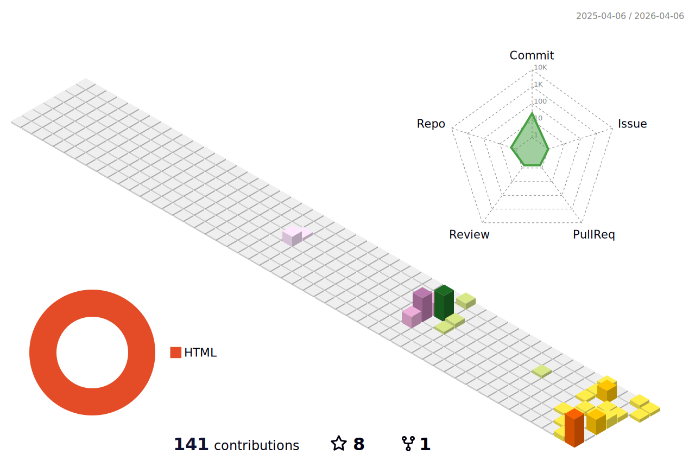

<picture>
  <source media="(prefers-color-scheme: dark)" srcset="https://raw.githubusercontent.com/Marshmellond/Marshmellond/output/github-contribution-grid-snake-dark.svg">
  <source media="(prefers-color-scheme: light)" srcset="https://raw.githubusercontent.com/Marshmellond/Marshmellond/output/github-contribution-grid-snake.svg">
  
</picture>

## 🛠️ Tech Stack

**Frontend**  

**Backend**  

**Database**  

**Big Data & Middleware**  

**Tools & IDE**  

📕 &nbsp;**Latest Blog Posts**
<!-- BLOG-POST-LIST:START -->

- [一些好用的Java第三方库](https://denox.cc/?p=1760608718241)
- [Java命名规范](https://denox.cc/?p=1758201655819)
- [Java学习笔记](https://denox.cc/?p=1758096318335)
- [张家界学院校园网一键登录](https://denox.cc/?p=1757472697805)
- [flex布局笔记](https://denox.cc/?p=1718327040636)

<!-- BLOG-POST-LIST:END -->